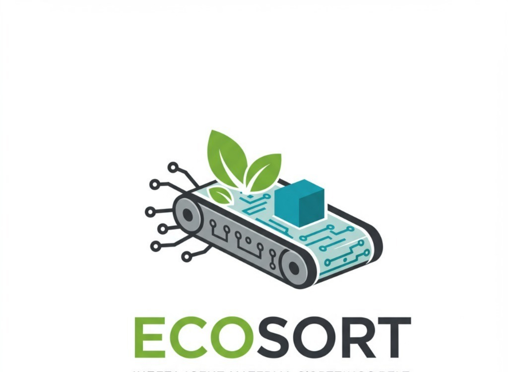
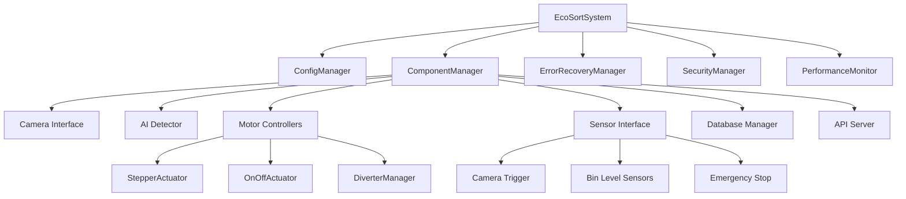

# EcoSort Industrial v2.1 - Enhanced Edition
## Sistema Avanzado de Clasificación Automática de Residuos

<div align="center">



[](https://www.python.org/downloads/)
[](https://opencv.org/)
[](https://github.com/ultralytics/ultralytics)
[](https://www.raspberrypi.org/)
[](LICENSE)

**Sistema de clasificación industrial de residuos con IA avanzada, monitoreo en tiempo real y recuperación automática de errores**

</div>

---

## 🚀 Características Principales

### ✨ **Nuevas Funcionalidades v2.1**

- **🔧 Recuperación Automática de Errores**: Sistema inteligente que detecta y corrige fallas automáticamente
- **🛡️ Seguridad Mejorada**: Paradas de emergencia, autenticación API y validación de acceso
- **📊 Monitoreo Avanzado**: Métricas en tiempo real, alertas y análisis de rendimiento
- **⚙️ Configuración Dinámica**: Recarga en caliente sin reiniciar el sistema
- **🔄 Gestión de Estado**: Estados del sistema mejorados con transiciones controladas
- **📱 API REST Expandida**: Nuevos endpoints para control y monitoreo completo
- **🧪 Testing Comprehensivo**: Suite de pruebas unitarias e integración

### 🏭 **Funcionalidades Industriales**

- **🤖 Clasificación IA**: Detección automática usando YOLOv8 optimizado
- **📦 Categorías**: Metal, plástico, vidrio, cartón y otros materiales
- **⚡ Tiempo Real**: Procesamiento < 500ms por objeto
- **🎯 Alta Precisión**: >95% de accuracy en condiciones controladas
- **🔧 Actuadores Múltiples**: Soporte para motores paso a paso y relés
- **📏 Sensores Inteligentes**: Niveles de tolva y triggers de objeto
- **📈 Base de Datos**: Registro completo de operaciones y métricas

---

## 📋 Tabla de Contenidos

- [Arquitectura del Sistema](#-arquitectura-del-sistema)
- [Requisitos](#-requisitos)
- [Instalación](#-instalación)
- [Configuración](#-configuración)
- [Uso](#-uso)
- [API y Monitoreo](#-api-y-monitoreo)
- [Mantenimiento](#-mantenimiento)
- [Solución de Problemas](#-solución-de-problemas)
- [Testing](#-testing)
- [Desarrollo](#-desarrollo)
- [Contribución](#-contribución)

---

## 🏗️ Arquitectura del Sistema

### Diagrama de Componentes



### Flujo de Procesamiento

1. **Detección**: Sensor de trigger detecta objeto
2. **Captura**: Cámara captura imagen del objeto
3. **Clasificación**: IA analiza y clasifica el material
4. **Cálculo**: Sistema calcula timing para activación
5. **Desviación**: Actuador dirige objeto a tolva correcta
6. **Registro**: Base de datos almacena resultado
7. **Monitoreo**: Sensores verifican niveles de tolvas

---

## 🔧 Requisitos

### Hardware Mínimo

- **Raspberry Pi 4** (4GB RAM recomendado)
- **Cámara USB/Pi Camera** (resolución mínima 640x480)
- **Motores paso a paso** A4988/DRV8825 o relés para actuadores
- **Sensores ultrasónicos** HC-SR04 para niveles de tolva
- **Sensor de trigger** (fotoeléctrico/inductivo)
- **Botón de parada de emergencia**
- **Fuente de alimentación** 12V/5A mínimo

### Software

- **Raspberry Pi OS** Bullseye o superior
- **Python 3.8+** con pip
- **OpenCV 4.8+**
- **Git** para clonado del repositorio

### Conectividad

- **Red Ethernet/WiFi** para API y monitoreo
- **GPIO** para control de hardware
- **Almacenamiento** microSD 32GB+ (Clase 10)

---

## 📦 Instalación

### 1. Preparación del Sistema

```bash
# Actualizar sistema
sudo apt update && sudo apt upgrade -y

# Instalar dependencias del sistema
sudo apt install -y python3-dev python3-pip git cmake build-essential
sudo apt install -y libopencv-dev python3-opencv
sudo apt install -y libatlas-base-dev libhdf5-dev libhdf5-serial-dev
sudo apt install -y libjasper-dev libqtgui4 libqt4-test

# Habilitar GPIO y cámara
sudo raspi-config
# Ir a Interfacing Options -> GPIO -> Enable
# Ir a Interfacing Options -> Camera -> Enable
```

### 2. Clonado del Repositorio

```bash
# Clonar repositorio
git clone https://github.com/chele-s/EcoSort-Industrial.git
cd EcoSort-Industrial

# Crear entorno virtual
python3 -m venv ecosort_env
source ecosort_env/bin/activate

# Instalar dependencias
pip install -r requirements_rpi.txt
```

### 3. Configuración de Hardware

```bash
# Configurar permisos GPIO
sudo usermod -a -G gpio $USER
sudo chmod 666 /dev/gpiomem

# Configurar permisos de cámara
sudo usermod -a -G video $USER

# Reiniciar para aplicar cambios
sudo reboot
```

### 4. Verificación de Instalación

```bash
# Activar entorno
source ecosort_env/bin/activate

# Ejecutar tests básicos
python -m pytest tests/test_installation.py -v

# Verificar hardware (sin componentes conectados)
python main_sistema_banda.py --simulation --debug
```

---

## ⚙️ Configuración

### Archivo de Configuración Principal

El sistema utiliza `Control_Banda/config_industrial.json` como archivo de configuración principal:

```json
{
  "version": "2.1",
  "camera_settings": {
    "index": 0,
    "frame_width": 640,
    "frame_height": 480,
    "fps": 30,
    "autofocus": true
  },
  "ai_model_settings": {
    "model_path": "IA_Clasificacion/best_ecosort_640.pt",
    "min_confidence": 0.5,
    "class_names": ["metal", "plastic", "glass", "carton", "other"]
  },
  "conveyor_belt_settings": {
    "belt_speed_mps": 0.15,
    "distance_camera_to_diverters_m": {
      "metal": 0.6,
      "plastic": 0.8,
      "glass": 1.0,
      "carton": 1.2
    }
  }
}
```

### Configuración de Hardware

#### Cámara
```json
"camera_settings": {
  "index": 0,
  "frame_width": 640,
  "frame_height": 480,
  "fps": 30,
  "brightness": 0.5,
  "contrast": 0.5,
  "autofocus": true,
  "backup_cameras": [1, 2],
  "auto_recovery": true
}
```

#### Sensores
```json
"sensors_settings": {
  "camera_trigger_sensor": {
    "pin_bcm": 18,
    "trigger_mode": "rising_edge",
    "debounce_time_ms": 50
  },
  "bin_level_sensors": {
    "enabled": true,
    "sensors": {
      "metal_bin": {
        "trigger_pin_bcm": 24,
        "echo_pin_bcm": 25,
        "empty_distance_cm": 180,
        "full_distance_cm": 20
      }
    }
  }
}
```

#### Actuadores
```json
"diverter_control_settings": {
  "diverters": {
    "metal": {
      "type": "stepper_A4988",
      "dir_pin_bcm": 2,
      "step_pin_bcm": 3,
      "enable_pin_bcm": 4,
      "steps_per_activation": 200
    },
    "plastic": {
      "type": "gpio_on_off",
      "pin_bcm": 7,
      "active_state": "HIGH",
      "activation_duration_s": 0.5
    }
  }
}
```

### Configuración de Seguridad

```json
"safety_settings": {
  "emergency_stop_enabled": true,
  "max_failed_attempts": 5,
  "lockout_duration_minutes": 30,
  "operational_limits": {
    "max_continuous_runtime_hours": 12,
    "max_temperature_celsius": 75
  }
}
```

---

## 🎯 Uso

### Inicio Básico

```bash
# Activar entorno
source ecosort_env/bin/activate

# Ejecución normal
python main_sistema_banda.py

# Con opciones avanzadas
python main_sistema_banda.py --config custom_config.json --debug

# Modo simulación (sin hardware)
python main_sistema_banda.py --simulation

# Modo mantenimiento
python main_sistema_banda.py --maintenance
```

### Opciones de Línea de Comandos

| Opción | Descripción |
|--------|-------------|
| `--config`, `-c` | Archivo de configuración personalizado |
| `--debug`, `-d` | Activar logging debug detallado |
| `--simulation`, `-s` | Ejecutar sin hardware (pruebas) |
| `--maintenance`, `-m` | Iniciar en modo mantenimiento |

### Control Remoto

#### Via Web Interface
Acceder a `http://ip-raspberry:5000` para:
- Monitor en tiempo real
- Control de sistema
- Visualización de métricas
- Configuración remota

#### Via API REST
```bash
# Estado del sistema
curl http://ip-raspberry:5000/api/status

# Pausar sistema
curl -X POST http://ip-raspberry:5000/api/pause

# Reanudar sistema
curl -X POST http://ip-raspberry:5000/api/resume

# Métricas detalladas
curl http://ip-raspberry:5000/api/metrics

# Entrar en modo mantenimiento
curl -X POST http://ip-raspberry:5000/api/maintenance/enter
```

### Estados del Sistema

El sistema maneja los siguientes estados:

- **INITIALIZING**: Inicializando componentes
- **IDLE**: Sistema listo, esperando inicio
- **RUNNING**: Operación normal activa
- **PAUSED**: Pausado temporalmente
- **MAINTENANCE**: Modo mantenimiento
- **ERROR**: Error requiere intervención
- **RECOVERING**: Recuperación automática activa
- **SHUTTING_DOWN**: Proceso de apagado
- **SHUTDOWN**: Sistema completamente detenido

---

## 📡 API y Monitoreo

### Endpoints Principales

#### Estado y Control
- `GET /api/status` - Estado general del sistema
- `GET /api/diagnostics` - Diagnósticos detallados
- `POST /api/start` - Iniciar sistema
- `POST /api/stop` - Detener sistema
- `POST /api/pause` - Pausar operación
- `POST /api/resume` - Reanudar operación

#### Métricas y Rendimiento
- `GET /api/metrics` - Métricas en tiempo real
- `GET /api/performance` - Análisis de rendimiento
- `GET /api/alerts` - Alertas activas
- `GET /api/logs` - Logs del sistema

#### Configuración
- `GET /api/config` - Configuración actual
- `PUT /api/config` - Actualizar configuración
- `POST /api/config/reload` - Recargar configuración

#### Mantenimiento
- `POST /api/maintenance/enter` - Entrar en modo mantenimiento
- `POST /api/maintenance/exit` - Salir de modo mantenimiento
- `GET /api/maintenance/status` - Estado de mantenimiento

### WebSocket para Tiempo Real

```javascript
// Conectar a WebSocket
const socket = io('http://ip-raspberry:5000');

// Recibir métricas en tiempo real
socket.on('metrics_update', (data) => {
    console.log('Nuevas métricas:', data);
});

// Recibir alertas
socket.on('alert', (alert) => {
    console.log('Alerta:', alert.message);
});

// Recibir eventos del sistema
socket.on('system_event', (event) => {
    console.log('Evento:', event);
});
```

### Dashboard Web

El dashboard web incluye:

- **Monitor Principal**: Estado en tiempo real
- **Métricas de Rendimiento**: Gráficos y estadísticas
- **Control de Sistema**: Botones de control
- **Configuración**: Editor de configuración
- **Logs**: Visualizador de logs en tiempo real
- **Alertas**: Panel de notificaciones

---

## 🔧 Mantenimiento

### Tareas Regulares

#### Diarias
```bash
# Verificar logs de errores
tail -100 logs/ecosort.log | grep ERROR

# Verificar espacio en disco
df -h

# Verificar métricas de rendimiento
curl http://localhost:5000/api/metrics | jq '.performance'
```

#### Semanales
```bash
# Limpiar logs antiguos
find logs/ -name "*.log.*" -mtime +7 -delete

# Verificar integridad de base de datos
python -c "from InterfazUsuario_Monitoreo.Backend.database import DatabaseManager; db = DatabaseManager(); db.verify_integrity()"

# Actualizar modelo de IA si disponible
# Seguir procedimiento de actualización de modelo
```

#### Mensuales
```bash
# Backup completo
python scripts/backup_system.py

# Calibración de sensores
python scripts/calibrate_sensors.py

# Actualización de dependencias
pip list --outdated
```

### Calibración

#### Calibración de Cámara
```bash
# Ejecutar calibración automática
python scripts/calibrate_camera.py --auto

# Calibración manual con imágenes de referencia
python scripts/calibrate_camera.py --manual --images calibration_images/
```

#### Calibración de Sensores de Nivel
```bash
# Calibración automática de tolvas
python scripts/calibrate_bin_sensors.py --auto

# Calibración manual con medidas conocidas
python scripts/calibrate_bin_sensors.py --manual --bin metal --empty 180 --full 20
```

#### Calibración de Velocidad de Banda
```bash
# Medir velocidad real de banda
python scripts/calibrate_belt_speed.py --measure

# Ajustar configuración basada en medición
python scripts/calibrate_belt_speed.py --adjust
```

### Backup y Restauración

#### Crear Backup
```bash
# Backup automático (configurado en cron)
python scripts/backup_system.py --auto

# Backup manual completo
python scripts/backup_system.py --full --output /external/storage/
```

#### Restaurar Backup
```bash
# Restaurar desde backup específico
python scripts/restore_system.py --backup backup_20241220_143000.tar.gz

# Restaurar solo configuración
python scripts/restore_system.py --config-only --backup backup_file.tar.gz
```

---

## 🚨 Solución de Problemas

### Problemas Comunes

#### 1. Sistema No Inicia

**Síntomas**: Error al ejecutar `main_sistema_banda.py`

**Soluciones**:
```bash
# Verificar dependencias
pip check

# Verificar permisos GPIO
ls -l /dev/gpiomem

# Ejecutar en modo debug
python main_sistema_banda.py --debug --simulation

# Verificar configuración
python -c "from main_sistema_banda import ConfigManager; ConfigManager('Control_Banda/config_industrial.json')"
```

#### 2. Cámara No Detectada

**Síntomas**: Error "No se encontró ninguna cámara disponible"

**Soluciones**:
```bash
# Verificar dispositivos de cámara
ls /dev/video*

# Probar cámara manualmente
python -c "import cv2; cap = cv2.VideoCapture(0); print(cap.isOpened())"

# Verificar permisos
groups $USER | grep video

# Configurar cámara en raspi-config
sudo raspi-config
```

#### 3. Errores de GPIO

**Síntomas**: "Permission denied" al acceder GPIO

**Soluciones**:
```bash
# Verificar permisos
sudo usermod -a -G gpio $USER

# Verificar servicio GPIO
sudo systemctl status pigpiod

# Verificar conexiones
gpio readall
```

#### 4. Modelo de IA No Carga

**Síntomas**: Error al cargar modelo YOLOv8

**Soluciones**:
```bash
# Verificar archivo del modelo
ls -la IA_Clasificacion/best_ecosort_640.pt

# Verificar dependencias de IA
pip list | grep ultralytics

# Probar carga manual
python -c "from ultralytics import YOLO; model = YOLO('IA_Clasificacion/best_ecosort_640.pt')"

# Descargar modelo de respaldo
wget https://github.com/ultralytics/assets/releases/download/v0.0.0/yolov8n.pt -O IA_Clasificacion/backup_model.pt
```

#### 5. Base de Datos Bloqueada

**Síntomas**: "Database is locked" en logs

**Soluciones**:
```bash
# Verificar procesos usando DB
lsof InterfazUsuario_Monitoreo/ecosort_data.db

# Reparar base de datos
sqlite3 InterfazUsuario_Monitoreo/ecosort_data.db "PRAGMA integrity_check;"

# Reiniciar con backup
cp InterfazUsuario_Monitoreo/ecosort_data.db InterfazUsuario_Monitoreo/ecosort_data.db.backup
```

### Logs de Diagnóstico

#### Ubicaciones de Logs
- **Principal**: `logs/ecosort.log`
- **Sistema**: `/var/log/syslog`
- **GPIO**: `logs/gpio_debug.log`
- **API**: `logs/api_access.log`

#### Análisis de Logs
```bash
# Errores recientes
grep -i error logs/ecosort.log | tail -20

# Actividad de clasificación
grep "Objeto.*procesado" logs/ecosort.log | tail -10

# Problemas de hardware
grep -i "hardware\|gpio\|sensor" logs/ecosort.log

# Métricas de rendimiento
grep "Métricas del sistema" logs/ecosort.log | tail -5
```

### Herramientas de Diagnóstico

#### Script de Diagnóstico Completo
```bash
python scripts/system_diagnostics.py --full
```

#### Verificación de Hardware
```bash
python scripts/hardware_test.py --all
```

#### Test de Rendimiento
```bash
python scripts/performance_test.py --duration 60
```

---

## 🧪 Testing

### Ejecutar Suite de Tests

```bash
# Activar entorno
source ecosort_env/bin/activate

# Tests completos
python -m pytest tests/ -v

# Tests específicos
python -m pytest tests/test_config_manager.py -v

# Tests con cobertura
python -m pytest tests/ --cov=main_sistema_banda --cov-report=html

# Tests de integración
python -m pytest tests/test_integration.py -v --slow

# Tests de rendimiento
python -m pytest tests/test_performance.py -v
```

### Tipos de Tests

#### Tests Unitarios
- Componentes individuales
- Validación de configuración
- Lógica de clasificación
- Manejo de errores

#### Tests de Integración
- Sistema completo simulado
- Interacción entre componentes
- Flujo de procesamiento
- API endpoints

#### Tests de Rendimiento
- Tiempo de procesamiento
- Uso de memoria
- Throughput del sistema
- Latencia de respuesta

### Continuous Integration

```yaml
# .github/workflows/ci.yml
name: EcoSort CI
on: [push, pull_request]
jobs:
  test:
    runs-on: ubuntu-latest
    steps:
    - uses: actions/checkout@v2
    - name: Set up Python
      uses: actions/setup-python@v2
      with:
        python-version: 3.8
    - name: Install dependencies
      run: pip install -r requirements_rpi.txt
    - name: Run tests
      run: python -m pytest tests/ -v
```

---

## 💻 Desarrollo

### Estructura del Proyecto

```
EcoSort/
├── main_sistema_banda.py          # Sistema principal mejorado
├── Control_Banda/
│   ├── config_industrial.json     # Configuración principal v2.1
│   └── RPi_control_bajo_nivel/
│       ├── motor_driver_interface.py    # Control de actuadores mejorado
│       ├── conveyor_belt_controller.py  # Control de banda
│       └── sensor_interface.py          # Interfaz de sensores
├── IA_Clasificacion/
│   ├── Trash_detect.py            # Detector de IA optimizado
│   └── best_ecosort_640.pt        # Modelo entrenado
├── InterfazUsuario_Monitoreo/
│   ├── Backend/
│   │   ├── database.py            # Gestor de base de datos
│   │   └── api.py                 # API REST mejorada
│   └── Frontend_ecosort/          # Dashboard web reactivo
├── tests/
│   ├── test_ecosort_enhanced.py   # Suite de tests comprehensiva
│   ├── test_integration.py        # Tests de integración
│   └── test_performance.py        # Tests de rendimiento
├── scripts/
│   ├── backup_system.py           # Scripts de mantenimiento
│   ├── calibrate_sensors.py       # Calibración automática
│   └── system_diagnostics.py      # Diagnósticos del sistema
├── docs/                          # Documentación detallada
├── logs/                          # Archivos de log
└── requirements_rpi.txt           # Dependencias actualizadas
```

### Guía de Contribución

#### Setup del Entorno de Desarrollo

```bash
# Clonar repositorio
git clone https://github.com/chele-s/EcoSort.git
cd EcoSort

# Crear entorno de desarrollo
python -m venv dev_env
source dev_env/bin/activate

# Instalar dependencias de desarrollo
pip install -r requirements_dev.txt

# Instalar pre-commit hooks
pre-commit install
```

#### Estándares de Código

```bash
# Formatear código
black main_sistema_banda.py

# Verificar estilo
flake8 main_sistema_banda.py

# Type checking
mypy main_sistema_banda.py

# Tests antes de commit
python -m pytest tests/ -v
```

#### Proceso de Contribución

1. **Fork** del repositorio
2. **Crear branch**: `git checkout -b feature/nueva-funcionalidad`
3. **Desarrollar** siguiendo estándares
4. **Tests**: Asegurar 100% de tests pasan
5. **Commit**: Mensajes descriptivos
6. **Push**: `git push origin feature/nueva-funcionalidad`
7. **Pull Request** con descripción detallada

### API de Desarrollo

#### Extender Funcionalidad

```python
# Agregar nuevo tipo de actuador
class ServoActuator(BaseActuator):
    def initialize(self) -> bool:
        # Implementar inicialización
        pass
    
    def activate(self, duration_s: float = 1.0) -> bool:
        # Implementar activación
        pass

# Registrar en DiverterManager
manager.register_actuator_type('servo', ServoActuator)
```

#### Agregar Estrategia de Recuperación

```python
# Nueva estrategia de recuperación
class CustomRecoveryStrategy:
    async def can_recover(self, error: SystemError) -> bool:
        return error.component == 'custom_component'
    
    async def attempt_recovery(self, error: SystemError, system) -> bool:
        # Implementar lógica de recuperación
        return True

# Registrar estrategia
recovery_manager.register_strategy('custom_failure', CustomRecoveryStrategy())
```

---

## 📄 Licencia

Este proyecto está licenciado bajo la Licencia MIT - ver el archivo [LICENSE](LICENSE) para detalles.

---

## 👥 Autores y Contribuidores

### Equipo Principal
- **Gabriel Calderón** - *Arquitectura del Sistema y IA*
- **Elias Bautista** - *Control de Hardware y Sensores*
- **Cristian Hernandez** - *Interfaz Web y Base de Datos*

### Colaboradores v2.1
- **Sistema de Recuperación de Errores** - Análisis de fallos y recuperación automática
- **Monitoreo Avanzado** - Métricas en tiempo real y alertas
- **Seguridad Mejorada** - Autenticación y validación de acceso
- **Testing Comprehensivo** - Suite de pruebas unitarias e integración

---

## 🙏 Agradecimientos

- **Comunidad Open Source** por las librerías utilizadas
- **Ultralytics** por YOLOv12 y documentación excelente
- **OpenCV Community** por las herramientas de visión computacional
- **Raspberry Pi Foundation** por el hardware accesible
- **Flask & SocketIO** por la infraestructura web

---

## 📞 Soporte y Contacto

### Documentación Adicional
- [Wiki del Proyecto](https://github.com/chele-s/EcoSort/wiki)
- [Guía de Instalación Detallada](docs/installation_guide.md)
- [Manual de Usuario](docs/user_manual.md)
- [Documentación de API](docs/api_documentation.md)

### Reportar Problemas
- [Issues de GitHub](https://github.com/chele-s/EcoSort/issues)
- [Discusiones](https://github.com/chele-s/EcoSort/discussions)

### Comunidad
- [Discord Server](https://discord.gg/ecosort)
- [Foro de Usuarios](https://forum.ecosort.com)

---

<div align="center">

**⭐ Si este proyecto te resulta útil, considera darle una estrella en GitHub ⭐**


**Hecho con ❤️ para un futuro más limpio y sostenible**

</div>
